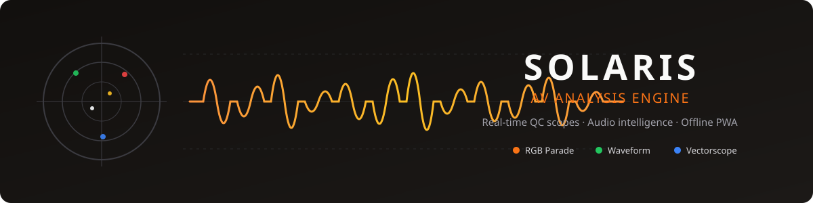

<div align="center">



# Solaris | AV Analysis Engine

**Broadcast-grade technical QC for video & audio — entirely in the browser.**

RGB parade, waveform, vectorscope and real-time FFT spectrograms for high-volume media pipelines. No plugins, no installs: open a URL and start analyzing.

[](https://solaris.chr-z.dev)
[](https://github.com/chr-z/solaris-av-engine/actions/workflows/ci.yml)
[](https://github.com/chr-z/solaris-av-engine/actions)
[](LICENSE)

EN / PT-BR · PWA offline-first · Keyboard-first analyst workflow

</div>

## Why Solaris

Manual QC doesn't scale. Solaris was originally architected to support an EdTech pipeline delivering thousands of hours of content per month — it replaces the "open three tools and eyeball it" workflow with one browser tab that scopes every asset before it ships.

- **Zero-install QC** — analysts run full signal analysis from a URL; IT deploys nothing on workstations.
- **Analyst-speed interaction** — J/K/L shuttle, frame-stepping, time markers and `Ctrl+S` keep hands on the keyboard, eyes on the scopes.
- **Team-aware** — Firebase presence and optimistic locking let multiple analysts work the same queue without stepping on each other.
- **Works offline** — installable PWA; cached shell + assets keep sessions alive through flaky studio connections.

## Features

### Scopes & Monitors (Canvas DSP, 60 fps)

| Monitor | What it tells you |
| --- | --- |
| **RGB Parade** | Per-channel exposure errors, color casts by column |
| **Waveform** | Luma levels vs. broadcast-safe ranges (IRE graticule) |
| **Vectorscope** | Chroma hue/saturation drift, skin-tone line reference |
| **FFT Spectrogram** | Frequency content over time — hum, hiss, phase issues |
| **Audio Waveform + RMS** | Loudness normalization problems at a glance |

Rendering uses Canvas 2D with `willReadFrequently` pixel pipelines instead of WebGL — no GPU driver roulette on locked-down corporate machines, still smooth during 4K playback.

### Analyst Workflow

- **Presets** — one click reconfigures the whole monitor grid per content type: *Clean*, *Framing*, *Leveling*, *On-site Ceiling*, *Home Ceiling*.
- **Keyboard shortcuts** — `Space`/`K` play-pause, `J`/`L` jump, `↑`/`↓` frame-step, `T` mark timecode, `Ctrl+S` save, `V` toggle compare, `?` help modal.
- **Time markers & findings** — log inconformities against the timeline; drafts autosave locally.

### Reporting

- **QC Report export (free tier)** — self-contained HTML report of every finding, printable to PDF via print-optimized CSS. Attach it to the delivery ticket.
- **A/B Compare (Pro)** — side-by-side two-media comparison with synced playback, for pre/post-encode or master/version checks.

### Platform

- **i18n EN/PT-BR** with instant switcher
- **PWA offline-first**: precached shell, stale-while-revalidate hashed assets, graceful offline fallback
- **Accessible**: visible focus rings, ARIA live regions, skip link, `prefers-reduced-motion` support
- **Secure stream proxying**: serverless middleware for Google Drive/YouTube sources with byte-range seeking

## Pricing

| | Free | Pro |
| --- | --- | --- |
| Price | **$0** | **$9/mo** per seat |
| All scopes & monitors | ✓ | ✓ |
| QC report export | ✓ | ✓ |
| Presets & keyboard workflow | ✓ | ✓ |
| Offline PWA | ✓ | ✓ |
| **A/B Compare mode** | — | ✓ |
| Priority support | — | ✓ |

Pro activates fully **offline**: paste your license key into *Upgrade to Pro* — entitlement is verified locally via HMAC-SHA256 (WebCrypto), no license server round-trip, works behind firewalls.

> Licensing is owner-side: keys are generated with `scripts/gen_license_key.mjs` using a secret that lives only in the operator's environment — never in the repo, never in a `VITE_` variable.

## Quick Start

```bash
git clone https://github.com/chr-z/solaris-av-engine.git
cd solaris-av-engine
npm install
npm run dev        # http://localhost:5173
```

```bash
npm test           # Vitest suite (unit, utils, hooks)
npm run lint       # ESLint flat config
npm run build      # production bundle w/ code splitting
```

Configure `.env` with your own Firebase / Google Cloud credentials (`VITE_GOOGLE_CLIENT_ID`, `VITE_GOOGLE_API_KEY`, `VITE_FIREBASE_*`). Optional build override: `VITE_SOLARIS_EDITION=free|pro`.

## Architecture Highlights

```
src/
├── components/
│   ├── Analysis/        # workspace, lazy-loaded compare panes
│   ├── Monitors/        # scope canvases + preset selector
│   └── Admin/           # pro upgrade flow, bug reports
├── hooks/               # useAVAnalysis, useCompareMode, useAnalystShortcuts…
├── utils/               # pure, tested cores: presets, shortcuts,
│                        # qcReport, compareMode, rowFiltering…
├── i18n/                # EN/PT dictionaries, t() helper
└── pwa/                 # service worker registration, offline status
```

- **Decoupled render loop** — heavy pixel work runs in animation frames outside React's cycle (`useAVAnalysis`), keeping the UI responsive during 4K playback.
- **Pure-core architecture** — filtering, preset resolution, shortcut matching, report generation and licensing logic are pure typed functions with dedicated Vitest coverage; components stay thin.
- **Code splitting** — Firebase, React vendor and the analysis workspace ship as separate chunks; modals load on demand.
- **Data layer** — Google Sheets API v4 as a dynamic CMS for work orders; Firebase RTDB presence + optimistic locking; role-based rules validate permissions at the database level.

## Roadmap

- [x] Core engine: RGB/Waveform/Vectorscope/Spectrogram monitors
- [x] Secure stream proxying (Drive/YouTube, byte-range)
- [x] i18n EN/PT-BR + accessibility pass
- [x] Offline PWA (manifest, service worker, offline indicator)
- [x] Performance: code splitting, memoization, lazy monitors
- [x] QC report export + print CSS
- [x] Content-type presets & keyboard shortcut layer
- [x] A/B compare mode (Pro) & offline licensing
- [ ] Cloud-rendered batch reports API
- [ ] Team seats dashboard & usage analytics

## Contributing & Support

Bug reports and PRs welcome — open an issue with your browser/OS and a clip that reproduces the problem. For commercial licensing of the Pro edition, reach out via GitHub.

---

<div align="center">

**Developed by Christian Eliel** · [Portfolio apps](https://github.com/chr-z)

*Software Engineer specializing in High-Performance Web Applications and Media Technology.*

</div>
